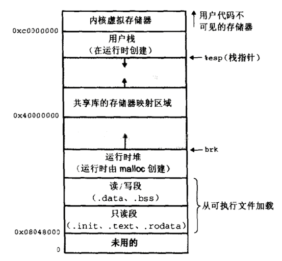

# Lab6

## 实现用户态的线程切换
需要实现寄存器
切换寄存器现场的汇编代码可以直接复制已经实现好的swtch
TODO: 需要理解ra和sp两个寄存器的含义。
https://zhuanlan.zhihu.com/p/295439950
- ra是return addr？保存的是函数返回的地址
- sp是栈指针

## 给一个多线程程序上锁
这个程序运行在宿主机上，直接使用pthread_mutex.
程序是一个桶哈希，要给每个桶（链表）上锁

## 线程同步，条件变量
如何使用条件变量实现同步
pthread_cond_wait