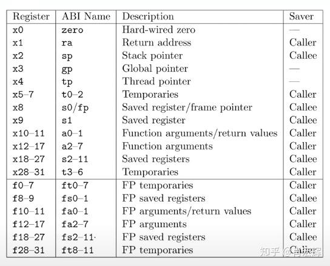

# mmap

mmap系统调用：内存映射，建立文件与内存地址空间的映射。
lazy

p->sz字段的大致原理，堆内存的上界指针，通过sbrk系统调用来调整：https://blog.csdn.net/gfgdsg/article/details/42709943

hit4 mmap实现：
在进程内存地址空间中找一个空闲的，建立映射，找一个空闲的vma进行记录。

hit5 处理mmap引起的缺页终端，分配物理内存并建立与文件的映射

hit6 munmap实现：
注意，要将文件写回

修改对应的函数，维护vma

难点：分配哪一段vm给vma
- 直接在堆内存上分配，但是释放时有问题